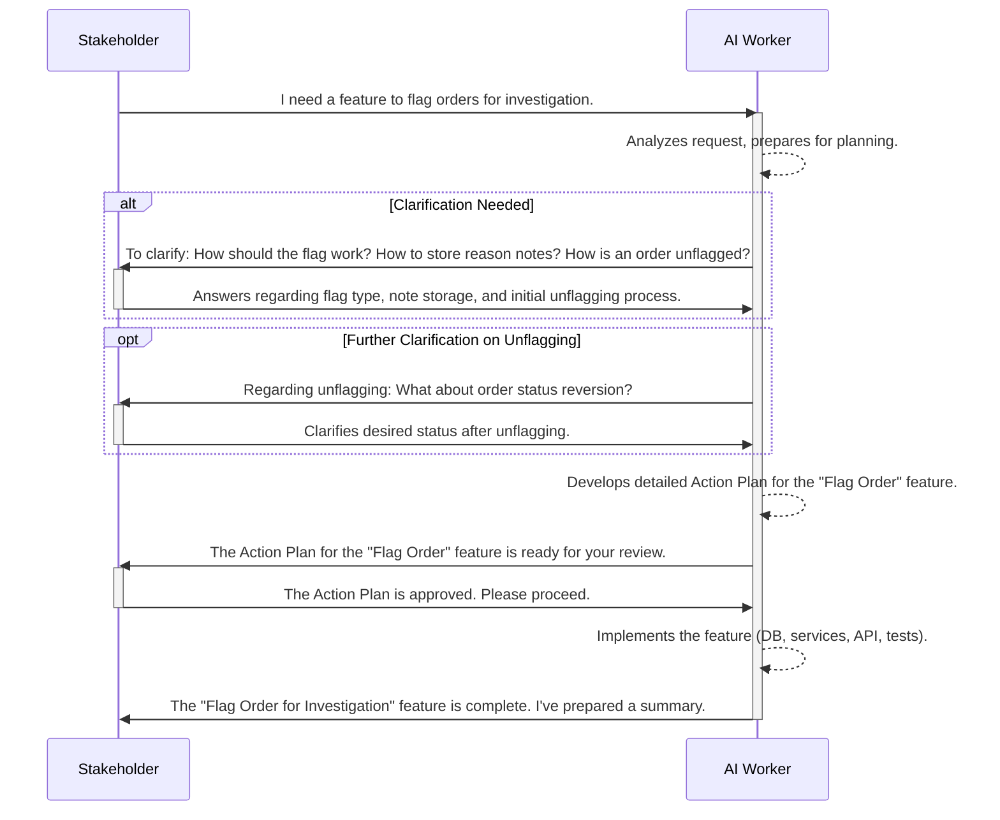

# Example Conversation: Implementing an Order Processing Feature

This document weaves a story illustrating a hypothetical, step-by-step interaction between a **Stakeholder (User)** and an **AI Worker** (guided by the principles in `prompt.md`) as they collaborate to implement a new feature in an order processing system.

## Workflow Overview for "Flag Order for Investigation" Feature



## Scenario Overview

Our story centers around a **Stakeholder Goal:** to enhance an existing Python-based e-commerce platform. The new capability would allow customer service representatives (CSRs) to manually flag an order as "Requires Investigation" and attach a reason. Crucially, this flag must halt the order's journey to shipment until explicitly cleared.

## The Unfolding Story of a Feature Request

---

### Chapter 1: The Initial Spark – A New Feature is Requested

The collaboration began when the Stakeholder approached the AI Worker with a clear need:

> **Stakeholder:** "Hi AI Worker, I need a new feature for our order management system. CSRs should be able to flag an order that needs investigation. When an order is flagged, it shouldn't be processed for shipment. They also need to add a reason for flagging it."

The AI Worker, ever diligent, immediately set to work. Its first task was to internalize the core of the request. It then meticulously prepared the ground for the project by creating the necessary documentation: a central plan file named `flag-order-investigation.md` (housed in `.minions/worker_plans/`) and a companion task-tracking file, `flag-order-investigation.tasks.md`. The standard plan template was dutifully applied, and the Stakeholder's request was carefully transcribed verbatim into the "Stakeholder requirements" section of the main plan. As a final preparatory step, the AI Worker performed an initial requirements completeness check, following the robust protocol outlined in its guiding principles (`prompt.md`, Step 4.1.7).

With these foundations in place, the AI Worker was ready to delve deeper.

---

### Chapter 2: Exploration and Discovery – Analyzing the Landscape

The AI Worker then embarked on a comprehensive analysis of the system's (hypothetical) existing codebase. This involved a careful review of key components like `OrderService.py` and `OrderModel.py`, an examination of the database schema, and any relevant API endpoints concerning orders. It also consulted any available internal knowledge bases or rules that might shed light on the current architecture.

As it explored, its insights, questions, and initial design thoughts began to crystallize within the `flag-order-investigation.md` plan. This document became a living record of its analytical journey. Here's a glimpse into its evolving understanding:

> # Plan: Flag Order for Investigation Feature
>
> ## Stakeholder requirements
>
> "Hi AI Worker, I need a new feature for our order management system. CSRs should be able to flag an order that needs investigation. When an order is flagged, it shouldn't be processed for shipment. They also need to add a reason for flagging it."
>
> ## Current state analysis
>
> 1.  The `Order` model (in `models/order_model.py`) currently has states: `PENDING`, `PROCESSING`, `SHIPPED`, `CANCELLED`.
> 2.  The `OrderService` (in `services/order_service.py`) contains methods like `process_order_for_shipment(order_id)`.
> 3.  There is an existing API endpoint `PUT /api/v1/orders/{order_id}/status` used to change order status.
> 4.  CSRs interact with orders via an internal admin panel (details of its frontend not fully known, but it consumes the backend API).
> 5.  No current mechanism exists to add arbitrary notes or flags outside of the main status.
>
> ### Identified Gaps/Assumptions/Design Considerations
>
> 1.  **Gap:** New order state or flag needed. Current states don't cover "Requires Investigation".
> 2.  **Gap:** Mechanism to store the "reason" note is missing.
> 3.  **Assumption:** The "flag" should act like a sub-status or a distinct boolean field. If it's a status, it needs to be integrated into the existing status lifecycle.
> 4.  **Design Consideration:** Should "Requires Investigation" be a new formal status (e.g., `INVESTIGATING`), or a boolean flag `is_flagged_for_investigation` on the `Order` model? A new status might be cleaner for state machines but requires more changes. A boolean flag is simpler to add.
> 5.  **Design Consideration:** How is an order "cleared" after investigation? This was not specified.
> 6.  **Security Concern:** Access to flag/unflag orders and add notes should be restricted to CSR roles.
> 7.  **Testability Issue:** Current tests for `OrderService` mainly cover happy paths for status transitions.
>
> ### Potential Impact Areas
>
> 1.  `models/order_model.py` (Order model changes)
> 2.  Database schema for `orders` table (new field(s))
> 3.  `services/order_service.py` (logic to flag, unflag, and check flag before shipment)
> 4.  `api/v1/orders_api.py` (new endpoint or modification to existing ones for CSRs)
> 5.  Admin Panel (Frontend changes will be needed - outside AI Worker's direct scope but important context)
> 6.  Unit tests for `OrderService` and API endpoints.
>
> ### Dependencies
>
> 1.  Python Flask (Web framework)
> 2.  SQLAlchemy (ORM for database interaction)
> 3.  Alembic (Database migrations)

---

### Chapter 3: Seeking Clarity – The First Round of Questions

Having thoroughly analyzed the request and the existing system, the AI Worker identified several areas needing further input from the Stakeholder. It carefully formulated a set of questions within the `flag-order-investigation.md` plan, also noting potential risks.

The content of the plan now included:
> ## Questions
>
> 1.  **(Functional Requirement - Flag Implementation)**
>     **Question:** Regarding the "flag", should this be implemented as a new, distinct order status (e.g., `INVESTIGATING`), or as a separate boolean field on the order (e.g., `is_under_investigation`) alongside the existing statuses? A new status would integrate into the existing state flow, while a boolean flag might be simpler to add but could make status queries more complex.
>     **Context:** Analysis (Design Consideration #4) identified two primary ways to implement this. Choice affects database schema and service logic complexity.
>     **Stakeholder response:**
>
> 2.  **(Functional Requirement - Storing Reason Note)**
>     **Question:** For the "reason note" CSRs add when flagging an order: Is a single text field sufficient? Are there any length limits or specific formatting requirements for this note? Will there be a history of notes if an order is flagged multiple times?
>     **Context:** Analysis (Gap #2) noted no current place for such notes. Details needed for schema design.
>     **Stakeholder response:**
>
> 3.  **(Functional Requirement - Clearing the Flag)**
>     **Question:** How should an order be "cleared" after it has been flagged for investigation? Is there a specific action CSRs take (e.g., an "Unflag" button)? What happens to the order status then (e.g., does it revert to its previous status or move to `PENDING` for reprocessing)?
>     **Context:** The initial request mentioned flagging but not the unflagging/resolution process (Design Consideration #5).
>     **Stakeholder response:**
>
> 4.  **(Security - Access Control for Flagging)**
>     **Question:** We assume that the ability to flag/unflag orders and add investigation notes should be restricted to users with a "CSR" role. Can you confirm this? Are there any other roles that might need this capability?
>     **Context:** Ensuring the feature has appropriate authorization (Security Concern #6).
>     **Stakeholder response:**
>
> ### Potential Risks
>
> 1.  (Risk 1 - **Scope Creep with Admin Panel**): If the Admin Panel frontend changes are complex, they might delay full feature rollout. Mitigation: Backend API will be designed to be clear and simple for frontend integration. This risk is primarily for stakeholder awareness as frontend is out of scope for AI Worker.
> 2.  (Risk 2 - **Complex State Management**): If a new formal status is chosen and interacts with many existing order processes (promotions, inventory), it could lead to complex state logic. Mitigation: Propose a boolean flag first if acceptable, or carefully map all state transitions if a new status is required. Ensure thorough testing.
> 3.  (Risk 3 - **Data Integrity for Notes**): If multiple CSRs can edit a note simultaneously or if note history is complex. Mitigation: For V1, assume a single, latest note is sufficient unless specified otherwise. If history is needed, it requires more design.

With these questions documented, the AI Worker reached out:

> **AI Worker:** "I have analyzed the request to add an order investigation flag feature and have prepared some questions to clarify the requirements. Please review the `flag-order-investigation.md` file in the `.minions/worker_plans/` directory, specifically the 'Questions' and 'Potential Risks' sections, and provide your responses there. I will await your input before proceeding to the action plan."

---

### Chapter 4: The Dialogue – Refining Understanding

The Stakeholder then reviewed the questions posed by the AI Worker directly within the `flag-order-investigation.md` document and provided their responses:

> ## Questions
>
> 1.  **(Functional Requirement - Flag Implementation)**
>     ...
>     **Stakeholder response:** "Let's go with a boolean field `is_under_investigation` for simplicity. It should default to `False`."
>
> 2.  **(Functional Requirement - Storing Reason Note)**
>     ...
>     **Stakeholder response:** "A single text field for the reason is fine for now. Let's call it `investigation_reason_note`. No strict length limit, but it should be a reasonable amount (e.g., max 1000 chars). Only the latest note is needed."
>
> 3.  **(Functional Requirement - Clearing the Flag)**
>     ...
>     **Stakeholder response:** "Yes, CSRs need an 'Unflag' action. When unflagged, the `is_under_investigation` should be set to `False`, and the `investigation_reason_note` can be cleared or kept for history (let's keep it for now). The order should then return to its status *before* it was flagged, if possible, or to `PENDING` if that's too complex to track."
>
> 4.  **(Security - Access Control for Flagging)**
>     ...
>     **Stakeholder response:** "Correct, only CSR roles should have this capability."

Upon reviewing these answers, the AI Worker noted that the Stakeholder's response to the third question—about reverting to the previous order status—introduced a potential complexity. True to its programming to seek explicit clarity, it decided a follow-up question was necessary.

The AI Worker updated the plan file again:
> ## Questions
>
> ...
>
> NEW: 5. **(Functional Requirement - Unflagging Status Reversion)**
>     **Question:** Regarding Q3 response: Reverting to the *exact previous status* before flagging could be complex if the order underwent other automated changes while flagged (though it shouldn't if shipment is blocked). Would it be acceptable for V1 that upon unflagging, the order always returns to a defined state like `PENDING_REPROCESSING` (a new simple status) or back to `PROCESSING` (if that makes sense), rather than trying to recall its exact pre-flag status?
>     **Context:** This impacts the complexity of the `OrderService.unflag_order` logic.
>     **Stakeholder response:**

The Stakeholder, appreciating the AI's diligence, provided a swift response to this new query:
> ## Questions
> ...
> NEW: 5. **(Functional Requirement - Unflagging Status Reversion)**
>     ...
>     **Stakeholder response:** "Good point. For V1, let's simplify. When an order is unflagged, it should move to a new status `PENDING_MANUAL_REVIEW`. CSRs will then manually move it to `PROCESSING` or another appropriate status."

This iterative dialogue ensured both parties were aligned before any concrete planning for implementation began.

---

### Chapter 5: The Blueprint – Crafting the Action Plan

With all ambiguities resolved, the AI Worker now had the clarity needed to construct a comprehensive action plan. This detailed blueprint, also documented within `flag-order-investigation.md`, outlined every step required to bring the feature to life.

Here is what the action plan section of the plan file looked like:
> ## Action plan
>
> 1.  **(Logical Area: Database & Model Changes)**
>     *   **Requirements Addressed**: Storing flag and reason note (Q1, Q2 responses).
>     *   **Key Design Decisions**: `is_under_investigation` (boolean), `investigation_reason_note` (String(1000)) fields on Order. New status `PENDING_MANUAL_REVIEW`.
>
>     Tasks:
>     1.1. **Task Description**: Add new status `PENDING_MANUAL_REVIEW` to Order status enum/choices.
>         *   **Files**: `models/order_model.py` (or wherever statuses are defined)
>         *   **Specific Changes**: Add `PENDING_MANUAL_REVIEW` to the list of possible order statuses.
>         *   **Justification**: Supports Q5 response for unflagging.
>         *   **Dependencies**: None
>         *   **Complexity**: Low
>         *   **Verification Criteria**: Code compiles. Status is present in model definitions.
>
>     1.2. **Task Description**: Modify `Order` model.
>         *   **Files**: `models/order_model.py`
>         *   **Specific Changes**: Add `is_under_investigation` (Boolean, default=False, nullable=False) and `investigation_reason_note` (String(1000), nullable=True) to the `Order` SQLAlchemy model.
>         *   **Justification**: Implements Q1 & Q2 responses for storing flag and note.
>         *   **Dependencies**: None
>         *   **Complexity**: Low
>         *   **Verification Criteria**: Model definition updated. Code compiles.
>
>     1.3. **Task Description**: Create Alembic migration script for database changes.
>         *   **Files**: `migrations/versions/xxxx_add_investigation_fields_to_orders.py` (New file)
>         *   **Specific Changes**: Generate and refine Alembic script to add `is_under_investigation` and `investigation_reason_note` columns to `orders` table, and to update status enum if it's DB-backed.
>         *   **Justification**: Applies schema changes to the database.
>         *   **Dependencies**: Task 1.1, 1.2
>         *   **Complexity**: Medium (Alembic script generation and review)
>         *   **Verification Criteria**: Migration script generated. `alembic upgrade head` runs successfully on a dev DB. Columns are present in DB table.
>
>     **Verification (Logical Area: Database & Model Changes)**:
>     *   Run `alembic current` to ensure migration is applied.
>     *   Inspect `orders` table schema in DB to confirm new fields and types.
>     *   Confirm `PENDING_MANUAL_REVIEW` is usable in model/service logic.
>
> 2.  **(Logical Area: Service Layer Implementation)**
>     *   **Requirements Addressed**: Logic for flagging, unflagging, blocking shipment.
>     *   **Key Design Decisions**: As per Q responses. Restricted to CSRs (Q4).
>
>     Tasks:
>     2.1. **Task Description**: Add `flag_order_for_investigation` method to `OrderService`.
>         *   **Files**: `services/order_service.py`
>         *   **Specific Changes**: Create `flag_order_for_investigation(order_id, reason_note, acting_user_id)`. Method should:
>             1.  Verify `acting_user_id` has CSR role (new helper or existing auth util).
>             2.  Fetch the order.
>             3.  Set `order.is_under_investigation = True`.
>             4.  Set `order.investigation_reason_note = reason_note`.
>             5.  Save changes to DB.
>         *   **Justification**: Implements core flagging logic.
>         *   **Dependencies**: Task 1.2
>         *   **Complexity**: Medium
>         *   **Verification Criteria**: Unit tests pass. Order in DB shows updated fields after calling.
>
>     2.2. **Task Description**: Add `unflag_order_from_investigation` method to `OrderService`.
>         *   **Files**: `services/order_service.py`
>         *   **Specific Changes**: Create `unflag_order_from_investigation(order_id, acting_user_id)`. Method should:
>             1.  Verify CSR role.
>             2.  Fetch the order.
>             3.  Set `order.is_under_investigation = False`.
>             4.  Set `order.status = OrderStatus.PENDING_MANUAL_REVIEW` (as per Q5 response).
>             5.  (Optional: Clear `investigation_reason_note` or leave as is - stakeholder said keep for now).
>             6.  Save changes.
>         *   **Justification**: Implements unflagging logic.
>         *   **Dependencies**: Task 1.1, 1.2
>         *   **Complexity**: Medium
>         *   **Verification Criteria**: Unit tests pass. Order fields and status updated correctly.
>
>     2.3. **Task Description**: Modify `process_order_for_shipment` in `OrderService`.
>         *   **Files**: `services/order_service.py`
>         *   **Specific Changes**: At the beginning of the method, add a check: `if order.is_under_investigation: raise OrderProcessingError("Order is flagged for investigation and cannot be shipped.")` or return an appropriate status/boolean.
>         *   **Justification**: Prevents shipment of flagged orders.
>         *   **Dependencies**: Task 1.2
>         *   **Complexity**: Low
>         *   **Verification Criteria**: Unit tests pass. Attempting to process a flagged order for shipment is blocked.
>
>     2.4. **Task Description**: Add Unit Tests for `OrderService` methods.
>         *   **Files**: `tests/unit/test_order_service.py`
>         *   **Specific Changes**: Add tests for `flag_order_for_investigation`, `unflag_order_from_investigation`, and the new check in `process_order_for_shipment`. Cover success cases, auth failures, order not found, etc.
>         *   **Justification**: Ensures service logic is robust and correct.
>         *   **Dependencies**: Task 2.1, 2.2, 2.3
>         *   **Complexity**: Medium
>         *   **Verification Criteria**: All new unit tests pass with good coverage.
>
>     **Verification (Logical Area: Service Layer Implementation)**:
>     *   All unit tests for `OrderService` pass.
>     *   Code review of `OrderService` changes for logic, security (role checks), and error handling.
>
> 3.  **(Logical Area: API Endpoint Implementation)**
>     *   **Requirements Addressed**: CSR ability to trigger flagging/unflagging via API.
>
>     Tasks:
>     3.1. **Task Description**: Create API endpoint `POST /api/v1/orders/{order_id}/flag-investigation`.
>         *   **Files**: `api/v1/orders_api.py`
>         *   **Specific Changes**: New endpoint. Expects `reason_note` in payload. Calls `OrderService.flag_order_for_investigation`. Handles auth (CSR only).
>         *   **Justification**: Exposes flagging functionality.
>         *   **Dependencies**: Task 2.1
>         *   **Complexity**: Medium
>         *   **Verification Criteria**: Endpoint returns 200 on success. Integration test passes.
>
>     3.2. **Task Description**: Create API endpoint `POST /api/v1/orders/{order_id}/unflag-investigation`.
>         *   **Files**: `api/v1/orders_api.py`
>         *   **Specific Changes**: New endpoint. Calls `OrderService.unflag_order_from_investigation`. Handles auth (CSR only).
>         *   **Justification**: Exposes unflagging functionality.
>         *   **Dependencies**: Task 2.2
>         *   **Complexity**: Medium
>         *   **Verification Criteria**: Endpoint returns 200 on success. Integration test passes.
>
>     3.3. **Task Description**: Add Integration Tests for new API endpoints.
>         *   **Files**: `tests/integration/test_orders_api.py`
>         *   **Specific Changes**: Add integration tests for successful flagging, unflagging, auth failures, and attempting to ship a flagged order.
>         *   **Justification**: Ensures API endpoints behave correctly end-to-end (within backend scope).
>         *   **Dependencies**: Task 3.1, 3.2, and underlying service/DB changes.
>         *   **Complexity**: High
>         *   **Verification Criteria**: All new integration tests pass.
>
>     **Verification (Logical Area: API Endpoint Implementation)**:
>     *   All integration tests pass.
>     *   Manually test endpoints with Postman/curl, checking responses and DB state changes.
>     *   Review API security (auth, input validation if any beyond reason_note).

The AI Worker then meticulously populated the `flag-order-investigation.tasks.md` file, listing all task IDs (from 1.1 through 3.3), each initially marked as "TO DO".

With the comprehensive plan ready, it was time to formally present it to the Stakeholder:

> **AI Worker:** "I have prepared a detailed action plan in `flag-order-investigation.md` based on our discussion. Please review it. I will begin implementation once I have your approval."

---

### Chapter 6: Green Light – Approval and Execution

The Stakeholder carefully reviewed the action plan. Satisfied with its thoroughness and alignment with the requirements, they gave their approval:

> **Stakeholder:** "The action plan looks comprehensive and addresses all points. Approved. Please proceed."

Upon receiving the green light, the AI Worker commenced the execution phase, tackling each task sequentially as outlined in the plan.

*   **For each task (e.g., starting with Task 1.1):**
    1.  The AI Worker would first consult the `flag-order-investigation.md` to understand the task's specifics.
    2.  It would then verify that all prerequisite tasks were marked "DONE" in the `.tasks.md` file.
    3.  The core work of implementation would follow (e.g., modifying `models/order_model.py`).
    4.  Local verification, such as ensuring code compilation and task-specific checks, would be performed.
    5.  A self-review against its internal checklist (as per `prompt.md` Step 4.5.9) would ensure quality.
    6.  If all checks passed, the AI Worker would update the task's status to "DONE" in `flag-order-investigation.tasks.md`.
*   This methodical process would continue for all tasks (1.2, 1.3, and so on).
*   After completing all tasks within a logical group (like "Database & Model Changes" after Task 1.3), the AI Worker would perform the broader "Verification (Logical Area)" steps defined in the plan for that group.
*   This systematic execution would proceed through all logical areas: Service Layer and then the API Layer.
*   Crucially, if any task failed verification or its self-review, or if a planned approach encountered unforeseen problems, the AI Worker was programmed to pause. It would document the issue thoroughly and, depending on the nature of the problem, either return to the Clarification Questions phase (Step 4.3 in `prompt.md`) or the Plan Modification phase (Step 4.4), re-engaging the Stakeholder for input.

---

### Chapter 7: The Culmination – Completion and Final Report

After diligently working through all tasks and successfully passing all verifications, the `flag-order-investigation.tasks.md` file showed every item marked "DONE". The AI Worker then moved to the final step: compiling the "Implementation Summary" and "Testing Notes" sections directly within the `flag-order-investigation.md` plan file.

This final report in the plan file read:
```markdown
## Implementation Summary

1.  **(Summary for Logical Area: Database & Model Changes)**
    *   **Fulfilled**: Added `is_under_investigation` (boolean) and `investigation_reason_note` (String) to `Order` model; added `PENDING_MANUAL_REVIEW` status (Tasks 1.1-1.2). Alembic migration (Task 1.3) created and verified.
    *   **Aligns with**: Q1, Q2, Q5 stakeholder responses.
    *   **Quality**: Model changes are simple and direct. Migration script handles schema update.

2.  **(Summary for Logical Area: Service Layer Implementation)**
    *   **Fulfilled**: `OrderService` now includes `flag_order_for_investigation`, `unflag_order_from_investigation` methods with CSR role checks (Tasks 2.1, 2.2). `process_order_for_shipment` now blocks flagged orders (Task 2.3).
    *   **Aligns with**: Functional requirements and security confirmation (Q4).
    *   **Quality**: Logic is encapsulated in service layer. Unit tests (Task 2.4) cover new methods and shipment block, achieving >95% coverage for new logic.

3.  **(Summary for Logical Area: API Endpoint Implementation)**
    *   **Fulfilled**: New API endpoints `POST /orders/{id}/flag-investigation` and `POST /orders/{id}/unflag-investigation` created (Tasks 3.1, 3.2).
    *   **Aligns with**: CSR operational needs.
    *   **Quality**: Endpoints secured for CSR role. Integration tests (Task 3.3) verify functionality including auth.

**Overall**: The feature to flag orders for investigation, add a reason, prevent shipment, and unflag to `PENDING_MANUAL_REVIEW` status has been implemented as per the approved plan. Security considerations for CSR-only access were included.

## Testing Notes

1.  **(Feature: Flagging an Order for Investigation)**
    *   **Purpose**: Verify CSR can flag an order and it's blocked from shipment.
    *   **Prerequisites**: An existing order `ORDER_ID`. CSR user credentials.
    *   **Test Steps**:
        1.  Using CSR credentials, send `POST /api/v1/orders/{ORDER_ID}/flag-investigation` with payload `{"reason_note": "Test investigation reason"}`.
        2.  Verify API returns 200 OK.
        3.  Check database: `orders` table for `ORDER_ID` should have `is_under_investigation = True` and `investigation_reason_note` set.
        4.  Attempt to call (simulated) `OrderService.process_order_for_shipment(ORDER_ID)`. (Or an API that triggers this if available for testing).
    *   **Expected Results**: API call for flagging successful. DB fields updated. `process_order_for_shipment` should fail or indicate blockage.

2.  **(Feature: Unflagging an Order)**
    *   **Purpose**: Verify CSR can unflag an order and it moves to correct status.
    *   **Prerequisites**: An order `FLAGGED_ORDER_ID` that is currently flagged.
    *   **Test Steps**:
        1.  Using CSR credentials, send `POST /api/v1/orders/{FLAGGED_ORDER_ID}/unflag-investigation`.
        2.  Verify API returns 200 OK.
        3.  Check database: `orders` table for `FLAGGED_ORDER_ID` should have `is_under_investigation = False` and `status = 'PENDING_MANUAL_REVIEW'`.
    *   **Expected Results**: API call successful. DB fields and status updated as specified.

3.  **(Security: Non-CSR Access Attempt)**
    *   **Purpose**: Verify non-CSR users cannot flag/unflag.
    *   **Prerequisites**: Non-CSR user credentials.
    *   **Test Steps**: Attempt to call flag/unflag endpoints with non-CSR credentials.
    *   **Expected Results**: API should return 403 Forbidden or 401 Unauthorized.
```

With the feature fully implemented and documented, the AI Worker informed the Stakeholder:

> **AI Worker:** "The implementation of the order investigation flag feature is now complete as per the approved plan. The `Implementation Summary` and `Testing Notes` have been added to `flag-order-investigation.md`. The system is ready for your review or further testing."

---

This concludes the story of our example interaction, demonstrating the structured, iterative, and transparent partnership fostered by the AI Worker's guiding principles.
