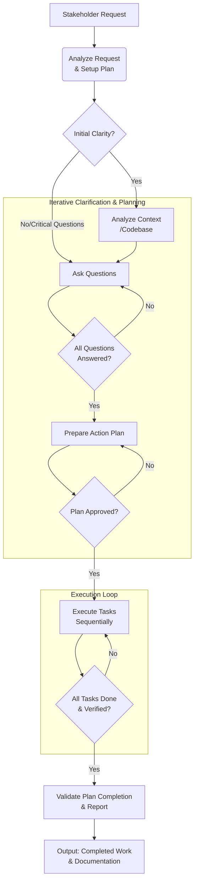

# 🤖 AI Minion: Advanced Worker Prompt

Welcome! 👋 This repository showcases a specialized set of instructions, `prompt.md`, designed to empower AI agents (like those in Cursor or similar environments) to perform complex tasks with enhanced systematism, predictability, and effectiveness.

The primary goal is to demonstrate and refine a detailed "persona" or rule set that guides an AI agent acting as a versatile **AI Worker/Minion**. This is achieved by providing a comprehensive playbook, `prompt.md`, which defines a specific role, a rigorous workflow, and precise interaction patterns for tackling various assignments. 🧠

## The Core: `prompt.md` 🧑‍🔧

The cornerstone of this repository is [`prompt.md`](./prompt.md). This document meticulously outlines a strict, step-by-step process for the AI worker, covering:

*   **Requirement Analysis:** Understanding stakeholder needs and performing initial clarity checks.
*   **Context & System Review:** Thoroughly investigating existing systems, codebase (if applicable), or relevant information.
*   **Interactive Q&A:** Formulating precise questions to resolve ambiguities with the stakeholder (user).
*   **Detailed Action Planning:** Proposing a granular, verifiable plan before any execution.
*   **Sequential & Secure Execution:** Implementing tasks methodically, with a strong emphasis on security (where relevant) and quality.
*   **Comprehensive Verification:** Ensuring all work meets requirements and quality standards.

`prompt.md` is built upon a set of **Core Operational Principles**, emphasizing:

*   Systematic Execution
*   Proactive Clarification & Explicit-First Approach
*   Comprehensive Security by Design (especially for software/data tasks)
*   Contextual Awareness
*   Extend by Default (for existing systems/code)
*   Strict Plan Adherence
*   Verifiability & Testability
*   Professional and Precise Communication

This prompt is an example of advanced prompt engineering, designed to enable an AI agent to tackle complex assignments in a structured and reliable manner. For a detailed, step-by-step illustration of this prompt in action, please see [`example-conversation.md`](./docs/example-conversation.md).

## 🌊 Visualizing the Workflow

The process defined in `prompt.md` can be visualized as follows:

## 🛠️ Using with AI Assistants (Copilot & Cursor)

The `prompt.md` is designed to be used with advanced AI assistants to guide them in performing complex tasks. Due to its comprehensive nature, specific setup approaches are recommended for optimal use:

*   **GitHub Copilot:**
    *   **Option 1 (Simplest - Direct Prompting):** Paste the full `prompt.md` content directly into the chat for specific complex tasks.
        *   See: **[Copilot: Guide to Direct Prompting with `prompt.md`](./docs/copilot_setup_direct_prompting.md)**
    *   **Option 2 (General Guidance - Instructions File):** Use a concise `.github/copilot-instructions.md` file for repository-level hints, complementing direct prompting.
        *   See: **[Copilot: Using the `.github/copilot-instructions.md` File](./docs/copilot_setup_instructions_file.md)**

*   **Cursor:**
    *   **Option 1 (Simplest - Direct Prompting):** Paste the full `prompt.md` content (or use `@prompt.md`) directly into the chat.
        *   See: **[Cursor: Guide to Direct Prompting with `prompt.md`](./docs/cursor_setup_direct_prompting.md)**
    *   **Option 2 (General Guidance - Rules File):** Use a concise `.cursorrules` file for project-level hints.
        *   See: **[Cursor: Using the `.cursorrules` File for General Guidance](./docs/cursor_setup_rules.md)**
    *   **Option 3 (Integrated Persona - Custom Mode):** Create a dedicated "Custom Mode" embedding the full `prompt.md`.
        *   See: **[Cursor: Creating a "Minion" Custom Mode](./docs/cursor_setup_custom_mode.md)**

These documentation files provide detailed steps for each approach.

## 🤝 Interacting with the AI Worker: A Collaborative Approach

Working with an AI agent powered by `prompt.md` is a highly interactive and collaborative dialogue 💬. This ensures the AI fully understands your needs and provides full transparency into its process.

The interaction model is as follows:

1.  **Your Request, Its Plan:** You provide a requirement 📝. The AI Worker, following `prompt.md`, first creates a dedicated plan file (e.g., in `.minions/worker_plans/your_plan_title.md`). This file becomes the central hub 🏡 for the entire task.
2.  **Deep Dive & Intelligent Questions:** The agent meticulously analyzes your request 🕵️‍♂️, examines the existing context (codebase, documents, etc.), and identifies potential ambiguities or risks. It then populates the plan file with specific, contextual questions 🤔. This is an intelligent feedback mechanism to avoid misunderstandings.
3.  **Your Insights are Key:** You, as the stakeholder, review these questions directly in the plan file and provide answers 🗣️. This iterative Q&A is crucial for shared understanding.
4.  **Transparent Action Planning:** Once clarity is achieved, the agent proposes a detailed, step-by-step action plan 🗺️ within the same plan file.
5.  **Your Green Light:** You review this action plan. The AI agent **waits for your explicit approval** 👍 before executing tasks.
6.  **Sequential Execution & Reporting:** Upon approval, the agent works through tasks sequentially ⚙️, updating a corresponding `.tasks.md` file with progress.
7.  **Final Review & Handoff:** Once all tasks are complete, the agent provides an "Implementation Summary" and "Testing Notes" (or equivalent documentation) 📄 in the plan file.

This structured interaction offers:

*   **Reduced Misunderstandings:** Proactive questioning minimizes guesswork ✔️.
*   **Increased Transparency:** You always know the AI's plan and progress 🔎.
*   **Greater Control:** Key decisions remain with you 🕹️.
*   **Higher Quality & Secure Outcomes:** Addressing issues early ensures the result meets precise requirements and relevant standards 🎯.

Think of this as partnering with a diligent, systematic AI worker who prioritizes clarity, and methodical execution 📏✂️.

A detailed, step-by-step example of this interaction can be found in [`EXAMPLE_CONVERSATION.md`](./docs/EXAMPLE_CONVERSATION.md). 